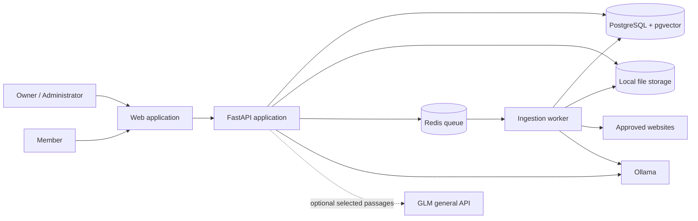

# System Architecture and Technology Stack

## 1. Architectural style

The MVP is a modular monolith with separate process roles:

- a React web client;
- a FastAPI application/API;
- one or more Python background workers;
- PostgreSQL with `pgvector`;
- Redis for queued jobs;
- local file storage; and
- Ollama running locally, with optional GLM API access.

The application and worker share domain modules and database contracts but run as separate processes. This keeps deployment manageable for one PC while isolating expensive ingestion work from interactive questions.

## 2. Context diagram



Solid lines are part of normal local operation. The dotted GLM connection exists only when the owner enables hosted generation.

## 3. Internal modules

| Module id | Responsibility | Depends on |
|---|---|---|
| `foundation` | Configuration, persistence, jobs, storage, and health primitives | — |
| `identity-access` | Accounts, sessions, roles, collection grants | foundation |
| `source-catalog` | Sources, versions, collections, metadata, status | identity-access, foundation |
| `ai-providers` | Stable generation and embedding interfaces for Ollama and GLM | foundation |
| `ingestion` | Upload registration, extraction, normalization, chunking | source-catalog, foundation |
| `web-sync` | Crawl policy, sitemap/page discovery, change detection | source-catalog, ingestion |
| `knowledge-index` | Embedding, vector/index generations, activation, retirement | ingestion, ai-providers, foundation |
| `retrieval-answering` | Query, authorization filters, hybrid search, reranking, answers, citations | identity-access, knowledge-index, ai-providers |
| `operations` | Job visibility, retry, audit events, diagnostics, backup | all operational modules |

Dependency direction follows the table and must not form cycles. Cross-module use goes through application services or explicit interfaces rather than directly accessing another module's internal tables.

## 4. Recommended technology stack

| Layer | Choice | Rationale |
|---|---|---|
| Frontend | React, TypeScript, Vite | Fast local development, simple static build, mature ecosystem |
| UI state/data | TanStack Query plus lightweight local state | Clear server-state caching without a large global store |
| Backend | Python 3.12+, FastAPI, Pydantic | Strong document/AI ecosystem and typed HTTP contracts |
| Persistence | PostgreSQL 16+ | Reliable transactional source activation and mature operations |
| Vector search | `pgvector` | Keeps metadata and vectors transactionally close for MVP scale |
| Keyword search | PostgreSQL full-text search with language-aware tokenization | Avoids another search service during MVP; Chinese uses application-side segmentation |
| Migrations | Alembic | Versioned, reviewable schema changes |
| ORM/query | SQLAlchemy 2.x | Explicit transactions and broad PostgreSQL support |
| Jobs | Redis plus Dramatiq | Simple durable background work, retries, and process separation |
| Local generation | Ollama | Local inference with no per-call API charge |
| Hosted generation | GLM general API through provider adapter | Optional higher-quality/cost-effective generation |
| Parsing | Docling-led adapter pipeline | Structured extraction with format-specific escape hatches |
| OCR | Tesseract adapter with English, Chinese (Simplified/Traditional), and Malay language packs | Local, free OCR baseline |
| Web extraction | HTTP crawler plus readability/content extraction; Playwright fallback | Cheap static path before browser rendering |
| File storage | Local filesystem behind a storage interface | Minimal MVP operations; future S3-compatible adapter |
| Unit/integration tests | pytest, Vitest, Testcontainers | TDD-driven domain, API, database, and queue testing with enforced coverage |
| Browser tests | Playwright | Happy and unhappy critical workflow coverage in a real browser |
| Packaging | Docker Compose | Reproducible services on one development/office PC |
| Observability | Structured logs, health endpoints, local metrics | Diagnosable without a hosted telemetry dependency |

Versions should be pinned during implementation after compatibility checks. The design intentionally avoids naming a fast-moving foundation model as a permanent default; tested model profiles belong in configuration and release notes.

## 5. AI provider contracts

Generation and embeddings use distinct interfaces:

```python
class GenerationProvider(Protocol):
    async def generate(self, request: GenerationRequest) -> GenerationResult: ...

class EmbeddingProvider(Protocol):
    async def embed(self, texts: list[str]) -> EmbeddingResult: ...
```

Provider-neutral request objects contain only supported application semantics. Provider SDK response objects do not escape the adapter boundary.

### Generation switching

Changing `generation_provider` from `ollama` to `glm` affects new answer requests after configuration validation. It does not alter stored chunks or vectors and therefore requires no re-index.

### Embedding switching

An index generation records provider, model, vector dimension, chunking policy version, and creation time. Changing any compatibility-critical value creates a new index generation. The current index stays active until the replacement is complete and validated.

### Example configuration

```yaml
ai:
  generation:
    provider: ollama
    model: ${OLLAMA_CHAT_MODEL}
    base_url: http://host.docker.internal:11434
  embeddings:
    provider: ollama
    model: ${OLLAMA_EMBED_MODEL}
    base_url: http://host.docker.internal:11434
```

To enable GLM generation:

```yaml
ai:
  generation:
    provider: glm
    model: ${GLM_MODEL}
    base_url: https://api.z.ai/api/paas/v4
```

The credential is supplied through a secret environment variable or local secret store and is not committed to configuration files.

## 6. Data model overview

Core entities:

- `workspace`
- `user`, `role`, `session`
- `collection`, `collection_grant`
- `source`, `source_version`, `source_version_item`
- `stored_object`, `extracted_artifact`
- `chunk`, `chunk_location` (each chunk records its detected language)
- `index_generation`, `chunk_embedding`
- `crawl_definition`, `sync_run`, `crawled_page`
- `job`, `job_attempt`, `outbox_event` (index-change ledger and job dispatch)
- `conversation`, `message`, `answer_citation`, `answer_feedback`
- `provider_configuration`, `provider_consent` (versioned owner acknowledgement), `audit_event`
- `invitation`, `retention_policy`
- `deletion_request`, `deletion_evidence`
- `backup_manifest`, `backup_source_inventory`

All knowledge-bearing records include `workspace_id`. Retrieval joins or filters against active source version, active index generation, collection grants, and non-deleted state in the database query itself.

## 7. Retrieval and answer pipeline

```text
Authenticate and authorize
→ normalize question and detect its language
→ optional query rewrite
→ semantic retrieval with authorization/version filters
→ language-aware keyword retrieval with the same filters
→ merge and deduplicate with reciprocal-rank fusion
→ confidence/evidence gate
→ generate using Ollama or GLM
→ validate citation identifiers
→ return answer and evidence
```

Initial retrieval should favor simple, observable scoring. Reciprocal-rank fusion is the MVP ranking method; a local cross-encoder reranker sits behind the same ranking interface and is added only when evaluation data shows a ranking failure it fixes. Add sophisticated query routing only after evaluation data demonstrates a specific failure.

### Multilingual keyword search

PostgreSQL full-text search has no Chinese tokenizer and no Malay stemmer. Each chunk therefore stores its detected language and a keyword vector built as follows: English with the `english` configuration, Malay with `simple`, and Chinese by application-side word segmentation followed by `simple`. Questions are processed the same way. The embedding model (`bge-m3`) is multilingual, so semantic retrieval does not depend on this step. The segmenter is chosen by evaluation in Task 13 and is part of the index compatibility key.

## 8. Local deployment topology

Docker Compose runs:

- `web`
- `api`
- `worker`
- `postgres`
- `redis`

Ollama may run natively on the host to use platform GPU acceleration reliably. The Compose configuration connects to the host endpoint. A fully containerized Ollama profile may be offered where supported.

Persistent host directories store PostgreSQL data, originals/derived artifacts, and backup output. Redis is not the source of truth; a job record in PostgreSQL supports recovery and diagnosis.

Jobs are dispatched through the transactional outbox: a state change, its job record (with a stable job ID), and an outbox entry commit in one PostgreSQL transaction. A dispatcher relays committed entries to Dramatiq on Redis and marks the entry published once the broker accepts it. Publication state and execution state are separate:

- A worker first claims the job atomically in PostgreSQL (`queued`/`retryable` → `running`) with a renewable lease. A duplicate message for a job that is already claimed or completed exits without doing work.
- An expired lease returns the job to `retryable`, so a crashed worker's job can be claimed again.
- If Redis is lost, the dispatcher re-publishes entries whose jobs are still `queued` or `retryable`; the claim step makes duplicates harmless.

This removes the dual-write gap between PostgreSQL and Redis without allowing two workers to run the same job concurrently.

### Supported platforms

| Platform | Container runtime | Ollama |
|---|---|---|
| Windows 11 x86_64 | Docker Desktop with WSL2 | Native Windows app |
| macOS 14+ on Apple Silicon | Docker Desktop | Native app with Metal acceleration |
| Ubuntu 22.04/24.04 LTS x86_64 | Docker Engine + Compose plugin | Native service |

Host paths, line endings, file locking, and `host.docker.internal` resolution differ between these platforms. Configuration and scripts must use platform-neutral Python helpers, and `make doctor` reports platform-specific remediation.

### Network exposure

The default profile binds the application gateway to loopback only. PostgreSQL, Redis, the worker, and internal API ports are never published to the host network. This profile is for one person using the host PC.

LAN access is a separate, explicit profile. It must:

- expose only one reverse-proxy/gateway port;
- terminate TLS with a certificate trusted by client devices;
- set an explicit host allowlist and CORS origin allowlist;
- use secure, HTTP-only, same-site cookies;
- trust forwarded headers only from the bundled proxy;
- reject public-internet binding by default; and
- document firewall and router requirements.

Remote administration over the public internet is out of scope. Use a separately managed private network or VPN rather than opening the application port directly.

### Practical hardware profiles

| Profile | Expected use |
|---|---|
| 16 GB RAM, CPU only | Development and small pilots with compact models; slower answers/OCR |
| 32 GB RAM, modern CPU | Recommended general local pilot profile |
| 32 GB+ RAM with supported GPU | Faster answers and larger local models |

Exact performance depends on model size, quantization, document volume, concurrency, and hardware. Benchmark the target customer machine rather than promising a universal latency.

## 9. Future hosted deployment

The following substitutions preserve domain behavior:

| Local MVP | Hosted edition |
|---|---|
| Local filesystem | S3-compatible object storage |
| Local PostgreSQL | Managed PostgreSQL with `pgvector` |
| Local Redis | Managed Redis or queue |
| Docker Compose | Container platform |
| Ollama | Ollama/vLLM GPU service or hosted provider |
| Single workspace | Tenant-aware control plane and isolated data plane policies |

A hosted edition also requires billing, tenant provisioning, rate limiting, abuse controls, managed secrets, centralized observability, disaster recovery, data residency choices, and a formal security program. These are not hidden MVP requirements.

## 10. Architecture constraints

- No model provider is called directly from controllers, workers, or domain entities.
- No retrieval query may omit authorization and active-version filters.
- Source activation and index activation are transactional pointer changes.
- Background jobs are idempotent or detect completed work before repeating it.
- Original content and credentials are excluded from normal logs.
- The system never silently switches from Ollama to GLM.
- A crawl cannot leave its host/path allowlist.
- External content is treated as untrusted data, not as instructions to the application or model.
